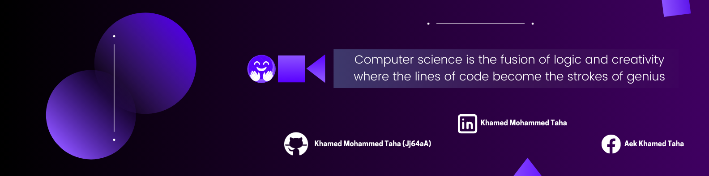

---

# Hi there, I'm Khamed Mohammed Taha 👋

Hello, I have a Bachelor's Degree in Computer Science and a keen interest in Artificial Intelligence. I specialize in Python development and web applications. I have experience as a Junior Backend Developer with Django & DRF, and I am proficient in languages like Python and JavaScript. I also have skills in FastAPI. I have worked on a variety of projects that have enhanced my skills in this field, and I am always eager to stay updated with the latest technological advancements.

---

## 🛠 Technologies & Tools

### Languages

### Frameworks & Libraries

### Databases

### Tools

### Operating Systems

## 📈 GitHub Stats

---

## 🏆 GitHub Trophies

---

## 📊 Top Languages

---

## 📫 Contact Me

- Email: [khamedkh297@gmail.com](mailto:khamedkh297@gmail.com)
- LinkedIn: [Khamed Mohammed Taha](https://www.linkedin.com/in/khamed-mohammed-taha-7149b1267/)
- Twitter: [@KhamedMedTaha](https://x.com/KhamedMedTaha)
